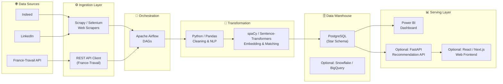
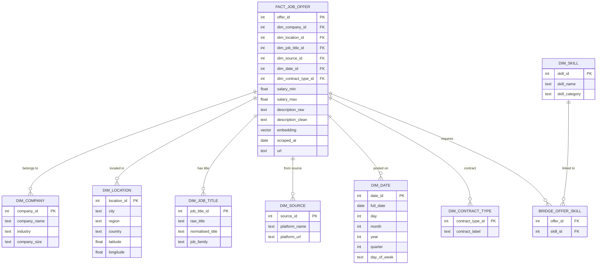
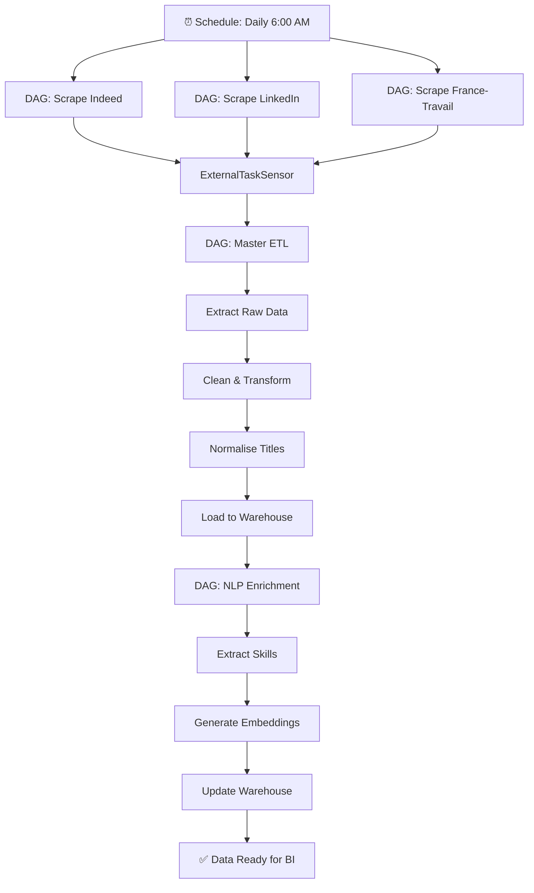

# 🧠 PROJET JOB INTELLIGENT — Implementation Plan

## 1. Project Summary

**Goal:** Build an end-to-end **Data Job Market Intelligence Platform** that:

1. **Centralises** job offers from multiple job boards (Indeed, LinkedIn, France-Travail) into a unified data warehouse.
2. **Recommends** the most relevant offers to candidates using keyword-based and **semantic (NLP)** matching.
3. **Visualises** market trends, salary distributions, skill demand, and geographic distribution via a **Power BI Dashboard**.
4. Guarantees **performance & scalability** to absorb a growing volume of data.

---

## 2. High-Level Architecture



---

## 3. Technology Stack

| Layer | Technology | Why |
|---|---|---|
| **Scraping** | Scrapy + Selenium (for JS-rendered pages) | Industry-standard, async, extensible |
| **API Ingestion** | `requests` / `httpx` + France-Travail API | Official API, clean JSON |
| **Orchestration** | Apache Airflow 2.x | Scheduling, retries, monitoring — your programme's core tool |
| **Data Cleaning** | Python 3.11+, Pandas, regex | Fast, familiar, flexible |
| **NLP / Recommendations** | spaCy (fr_core_news_lg), sentence-transformers, scikit-learn (cosine similarity) | Semantic matching, skills extraction |
| **Data Warehouse** | PostgreSQL 16 (Docker) | Free, robust, supports full-text search |
| **Dashboard** | Power BI Desktop | As required by the project spec |
| **Optional API** | FastAPI | For serving recommendations as a REST endpoint |
| **Optional Frontend** | Next.js / React | For a candidate-facing web app |
| **Containerisation** | Docker + Docker Compose | Reproducible environments |
| **Version control** | Git + GitHub/GitLab | Collaboration, CI/CD |

---

## 4. Data Warehouse — Star Schema Design



---

## 5. Project Folder Structure

```
projectWarhouse/
├── README.md
├── docker-compose.yml                # PostgreSQL, Airflow, pgAdmin
├── .env.example
├── .gitignore
│
├── scrapers/                         # Step 1 — Data Sources
│   ├── __init__.py
│   ├── indeed_scraper.py
│   ├── linkedin_scraper.py
│   ├── francetravail_api.py
│   ├── base_scraper.py               # Abstract base class
│   └── config.py                     # URLs, headers, rate-limits
│
├── etl/                              # Step 2 — Cleaning & Transformation
│   ├── __init__.py
│   ├── extract.py                    # read raw scraped JSON/CSV
│   ├── transform.py                  # cleaning, dedup, normalisation
│   ├── load.py                       # write to PostgreSQL
│   └── utils.py                      # helpers (date parsing, etc.)
│
├── nlp/                              # Step 3 — NLP & Recommendation
│   ├── __init__.py
│   ├── skills_extractor.py           # spaCy NER / regex patterns
│   ├── embeddings.py                 # sentence-transformers encoding
│   ├── recommender.py                # cosine similarity matching
│   └── title_normaliser.py           # map raw titles → standard titles
│
├── airflow/                          # Step 4 — Orchestration
│   ├── dags/
│   │   ├── dag_scrape_indeed.py
│   │   ├── dag_scrape_linkedin.py
│   │   ├── dag_scrape_francetravail.py
│   │   ├── dag_etl_pipeline.py       # master ETL DAG
│   │   └── dag_nlp_enrichment.py     # embedding + skill extraction
│   └── plugins/
│
├── db/                               # Step 5 — Database
│   ├── init.sql                      # DDL: create tables, indexes
│   ├── seed.sql                      # optional test data
│   └── migrations/                   # Alembic or raw SQL migrations
│
├── dashboard/                        # Step 6 — Power BI
│   ├── JobIntelligent.pbix           # Power BI project file
│   ├── queries/                      # DAX / M-query files
│   └── screenshots/                  # dashboard screenshots for reports
│
├── api/                              # Optional — FastAPI recommendation API
│   ├── main.py
│   ├── schemas.py
│   ├── routers/
│   │   └── recommend.py
│   └── requirements.txt
│
├── tests/                            # Unit & integration tests
│   ├── test_scrapers.py
│   ├── test_etl.py
│   ├── test_nlp.py
│   └── conftest.py
│
├── docs/                             # Documentation
│   ├── architecture.md
│   ├── data_dictionary.md
│   └── user_guide.md
│
└── requirements.txt                  # Python dependencies
```

---

## 6. Step-by-Step Implementation

### Phase 1 — Foundation & Infrastructure (Days 1-3)

| # | Task | Details |
|---|------|---------|
| 1.1 | **Initialise repository** | `git init`, `.gitignore` (Python, IDE, `.env`), `README.md` |
| 1.2 | **Set up Docker Compose** | Services: `postgres:16`, `pgadmin4`, `airflow-webserver`, `airflow-scheduler`, `airflow-init` |
| 1.3 | **Create database schema** | Write `db/init.sql` with all dimension tables, fact table, bridge table, indexes |
| 1.4 | **Set up Python env** | `requirements.txt` with Scrapy, selenium, pandas, psycopg2, sqlalchemy, spacy, sentence-transformers, fastapi |
| 1.5 | **Configure Airflow** | Mount DAGs folder, set executor to `LocalExecutor`, configure PostgreSQL as metadata DB |

> [!IMPORTANT]
> Decide early: **PostgreSQL only** or **PostgreSQL + Snowflake**? For an academic project, PostgreSQL is sufficient and simpler. Snowflake can be added later as an optional extension.

---

### Phase 2 — Data Scraping & Ingestion (Days 4-8)

| # | Task | Details |
|---|------|---------|
| 2.1 | **Build base scraper** | Abstract class in `scrapers/base_scraper.py` with methods: `scrape()`, `parse()`, `save_raw()` |
| 2.2 | **Indeed scraper** | Scrapy spider targeting data job keywords (`data engineer`, `data scientist`, `data analyst`, `ML engineer`). Extract: title, company, location, salary, description, URL, posting date |
| 2.3 | **LinkedIn scraper** | Selenium-based (LinkedIn requires JS). Same fields. Respect `robots.txt` & rate-limit (2-3 sec delay between requests) |
| 2.4 | **France-Travail API client** | REST client using the official API. Register for API key. Query parameters: `motsCles=data`, `typeContrat`, `departement` |
| 2.5 | **Raw data storage** | Save scraped data as JSON files in `data/raw/{source}/{date}/` before loading into DB |
| 2.6 | **Deduplication logic** | Hash-based dedup on (title + company + location) to avoid duplicate offers across sources |

> [!WARNING]
> **LinkedIn scraping** is against their Terms of Service for non-authorized use. For the academic project, consider using the LinkedIn **job search RSS** or a dataset from Kaggle as a substitute. Document this decision.

---

### Phase 3 — ETL Pipeline (Days 9-13)

| # | Task | Details |
|---|------|---------|
| 3.1 | **Extract** | Read raw JSON files, validate schema, handle missing fields |
| 3.2 | **Transform — Cleaning** | Remove HTML tags, normalise whitespace, handle encoding (UTF-8), parse salary ranges, standardise date formats |
| 3.3 | **Transform — Title normalisation** | Map raw titles → canonical job families using a mapping dictionary + fuzzy matching (e.g., "Jr Data Eng" → "Data Engineer") |
| 3.4 | **Transform — Location enrichment** | Geocode cities → (latitude, longitude, region) using `geopy` or a static mapping table |
| 3.5 | **Transform — Skills extraction** | Use spaCy NER + regex patterns to extract skills from descriptions (Python, SQL, Spark, Tableau, etc.) |
| 3.6 | **Load** | Upsert into PostgreSQL using SQLAlchemy. Populate dimension tables first (SCD Type 1), then fact table, then bridge table |
| 3.7 | **Data quality checks** | Assert: no null `offer_id`, valid salary ranges, no orphan FKs |

---

### Phase 4 — Airflow Orchestration (Days 14-17)

| # | Task | Details |
|---|------|---------|
| 4.1 | **DAG: Scraping** | One DAG per source, triggered daily at different stagger times. Use `@daily` schedule. Tasks: `scrape → validate → store_raw` |
| 4.2 | **DAG: Master ETL** | Triggered after all scraping DAGs complete (use `ExternalTaskSensor`). Tasks: `extract → clean → normalise → load` |
| 4.3 | **DAG: NLP Enrichment** | Triggered after ETL. Tasks: `extract_skills → generate_embeddings → update_warehouse` |
| 4.4 | **Error handling** | Configure retries (3x with exponential backoff), email alerts on failure, SLA misses |
| 4.5 | **Monitoring** | Use Airflow UI to track DAG runs, task durations, success rates |



---

### Phase 5 — NLP & Recommendation Engine (Days 18-22)

| # | Task | Details |
|---|------|---------|
| 5.1 | **Skills taxonomy** | Define a skills dictionary (~100-200 skills) with categories: Programming, Databases, Cloud, ML/AI, Tools, Soft Skills |
| 5.2 | **Skills extraction** | Use spaCy `Matcher` + regex to detect skills in job descriptions. Store in `BRIDGE_OFFER_SKILL` |
| 5.3 | **Sentence embeddings** | Use `sentence-transformers` (`all-MiniLM-L6-v2` or `paraphrase-multilingual-MiniLM-L12-v2` for French) to encode job descriptions into 384-d vectors |
| 5.4 | **Candidate profile input** | Accept: list of skills + free-text description of ideal job |
| 5.5 | **Matching algorithm** | Compute cosine similarity between candidate embedding and all offer embeddings. Combine with skill overlap score (weighted). Return top-K matches |
| 5.6 | **Evaluation** | Test with 10+ synthetic candidate profiles. Measure relevance (precision@K) |

> [!TIP]
> For the Power BI-focused project, you can simplify the recommendation engine to a **keyword-based scoring system** first, then add semantic matching as an enhancement. This makes the project achievable in stages.

---

### Phase 6 — Power BI Dashboard (Days 23-28)

| # | Task | Details |
|---|------|---------|
| 6.1 | **Connect to PostgreSQL** | Use the PostgreSQL connector in Power BI. DirectQuery or Import mode |
| 6.2 | **Data model** | Import the star schema. Set up relationships in Power BI model view |
| 6.3 | **Page 1: Market Overview** | KPIs: total offers, offers this week, avg salary, top cities. Charts: offers trend over time, distribution by job family |
| 6.4 | **Page 2: Skills Analysis** | Bar chart: top 20 most demanded skills. Heatmap: skills by job family. Treemap: skill categories |
| 6.5 | **Page 3: Geographic View** | Map visual: offers by city/region. Filters by job family, contract type, salary range |
| 6.6 | **Page 4: Salary Intelligence** | Box plot / column chart: salary distribution by job family, by experience level, by region. Median vs. mean |
| 6.7 | **Page 5: Source Comparison** | Compare platforms: volume by source, unique offers by source, avg salary by source |
| 6.8 | **Page 6: Job Recommender** | Slicer-based: select skills → filtered offers list. Display match score if API is available |
| 6.9 | **Theming & Polish** | Custom color theme (dark mode), consistent fonts, tooltips, drill-through pages |
| 6.10 | **Publish** | Publish to Power BI Service (if university license available) or export as PDF for report |

#### Proposed Dashboard Layout

```
┌─────────────────────────────────────────────────────────┐
│  📊 JOB INTELLIGENT — Data Job Market Intelligence      │
│  ┌──────┬──────┬──────┬──────┐                          │
│  │Total │ New  │ Avg  │ Top  │   ← KPI Cards            │
│  │Offers│ /Week│Salary│ City │                           │
│  └──────┴──────┴──────┴──────┘                          │
│  ┌─────────────────────┬───────────────────────┐        │
│  │  Offers Over Time   │   By Job Family       │        │
│  │  📈 Line Chart      │   📊 Bar Chart        │        │
│  └─────────────────────┴───────────────────────┘        │
│  ┌─────────────────────┬───────────────────────┐        │
│  │  Top Skills         │   Geographic Map      │        │
│  │  📊 Horizontal Bar  │   🗺️ Map Visual       │        │
│  └─────────────────────┴───────────────────────┘        │
│  Filters: [Job Family ▼] [Region ▼] [Contract ▼]       │
└─────────────────────────────────────────────────────────┘
```

---

### Phase 7 — Optional: REST API & Web Frontend (Days 29-32)

| # | Task | Details |
|---|------|---------|
| 7.1 | **FastAPI app** | Endpoints: `GET /offers` (search/filter), `POST /recommend` (accept skills + text, return ranked offers) |
| 7.2 | **Web frontend** | Next.js app: search bar, skill tag input, results list with match percentage, offer detail page |
| 7.3 | **Dockerise** | Add API & frontend services to `docker-compose.yml` |

---

### Phase 8 — Testing, Documentation & Delivery (Days 33-35)

| # | Task | Details |
|---|------|---------|
| 8.1 | **Unit tests** | Test scrapers (mock HTTP), ETL transforms, NLP extraction |
| 8.2 | **Integration tests** | End-to-end: scrape → ETL → query DB → verify data |
| 8.3 | **Documentation** | Architecture doc, data dictionary, user guide, README with setup instructions |
| 8.4 | **Final report** | Academic report covering: context, methodology, architecture, results, limitations, future work |
| 8.5 | **Presentation** | Slides with live dashboard demo |

---

## 7. User Review Required

> [!IMPORTANT]
> **Key decisions needed before implementation:**
>
> 1. **Database choice:** PostgreSQL only, or do you also want Snowflake/BigQuery?
> 2. **LinkedIn data:** Scrape (risky ToS violation) vs. use a Kaggle dataset vs. skip?
> 3. **Scope:** Full stack (API + frontend) or focus on **scraping + ETL + Power BI only**?
> 4. **NLP depth:** Simple keyword matching vs. full semantic embeddings?
> 5. **Language:** Are the job offers French-only, or also English?
> 6. **Timeline:** How many days/weeks do you have to deliver this project?

---

## 8. Verification Plan

### Automated Tests
- `pytest tests/` — unit tests for scrapers, ETL, NLP modules
- `docker-compose up -d` — verify all services start cleanly
- SQL validation queries against the warehouse to check data integrity

### Manual Verification
- Open Power BI dashboard and verify all visuals load correctly
- Test the recommendation engine with sample candidate profiles
- Verify Airflow DAGs execute end-to-end without errors in the Airflow UI
- Cross-check scraped data with live job board listings for accuracy

---

## 9. Risk Register

| Risk | Impact | Mitigation |
|------|--------|------------|
| Website structure changes break scrapers | High | Use robust CSS selectors, add monitoring alerts, version scrapers |
| Rate-limiting / IP blocking | Medium | Implement delays, use rotating proxies, respect robots.txt |
| French NLP model accuracy | Medium | Fine-tune on job-specific corpus, build custom skill dictionary |
| Data volume exceeds PostgreSQL capacity | Low | Partition tables, add indexes, consider Snowflake for scale |
| Power BI refresh scheduling | Low | Use scheduled refresh in Power BI Service, or manual import |
